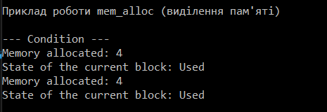
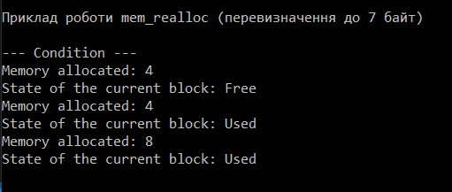
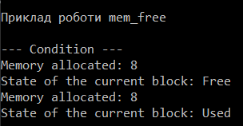

# OS Lab № 1 - Allocator


## Main part


Allocator it is useful to be able to control how you allocate dynamic memory. The obvious answer is new and delete, but sometimes people use other types of memory allocation, such as allocating a big amount of memory upfront and chunking it or just using the stack as memory.

The allocator model abstracts over this, by providing functions that give the containers memory to play around with. We don't really care where the memory we use comes from, just that there is enough of it when we need it.
### Alloc Description
The idea behind a block allocator is that it divides some large chunk of memory into smaller chunks of equal size. At its core, it is also a very simple allocator, since when an allocation is requested, it simply returns one of the free chunks of memory of a fixed size, and when a free chunk is requested, it simply saves this chunk of memory for later use. Thus, distribution is very fast and fragmentation is still very small.
#### Alocator functions

```
#void * mem_alloc (size_t size)#
```

When the user calls the mem_alloc function, the program scans the memory allocated during allocator initialization, looking for an unallocated block of memory of a suitable length. If no such block is found, it returns a NULL pointer.

### Reallocate function

```
void * mem_realloc (void * addr, size_t size)
```

The realloc () function changes the amount of allocated memory pointed to by ptr to the new value specified by the newsize parameter. The newsize is in bytes and can be larger or smaller than the original. A pointer to a block of memory is returned because it may be necessary to move the block as its size grows. In this case, the contents of the old block are copied into the new block and information is not lost.


### Free memory function
```
void mem_free (void * addr)
```

The corresponding addr block is removed from the list, added to the free list, and connected to adjacent free blocks, if any.

## DEMONSTRATION

### Creation allocator

##### Code
```
auto allocator = new MyAllocator();
cout << "Приклад роботи mem_alloc (видiлення пам'ятi)" << endl;
```


### We fill blocks of 4 bytes 2 times
#### Blocks can contain only *4* bytes. We must join 2 memory blocks
##### Code
```
auto memory = allocator->mem_alloc(sizeof(long));
auto memory2 = allocator->mem_alloc(sizeof(long));
allocator->mem_dump();
```

##### Output



### We fill blocks of 7bytes 1 time
#### We release the memory block and fill it with the specified number of bytes, fulfilling the given condition of multiplicity 4
##### Code
```
cout << "Приклад роботи mem_realloc (перевизначення до 7 байт)" endl;
auto memory3 = allocator->mem_realloc(memory, 7);
allocator->mem_dump();
```

##### Output

---
### We release the block that was holding 4 bytes
#### We clear the required block behind the address and combine it with the nearest free blocks
##### Code
```
cout << "Приклад роботи mem_free" << endl;
allocator->mem_free(memory2);
allocator->mem_dump();
```

##### Output

---

